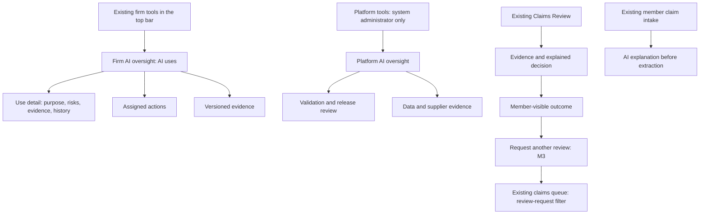
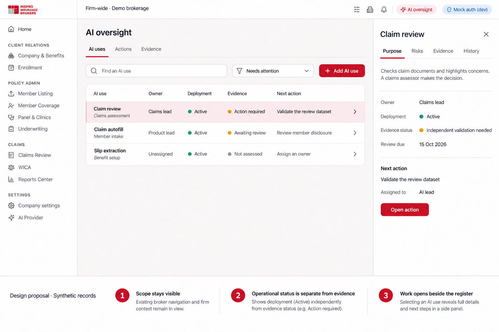
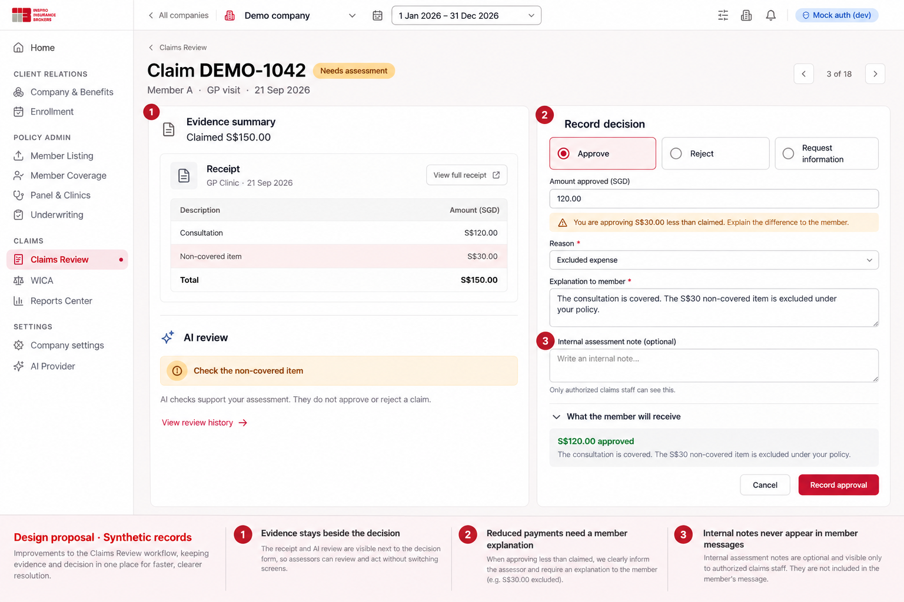
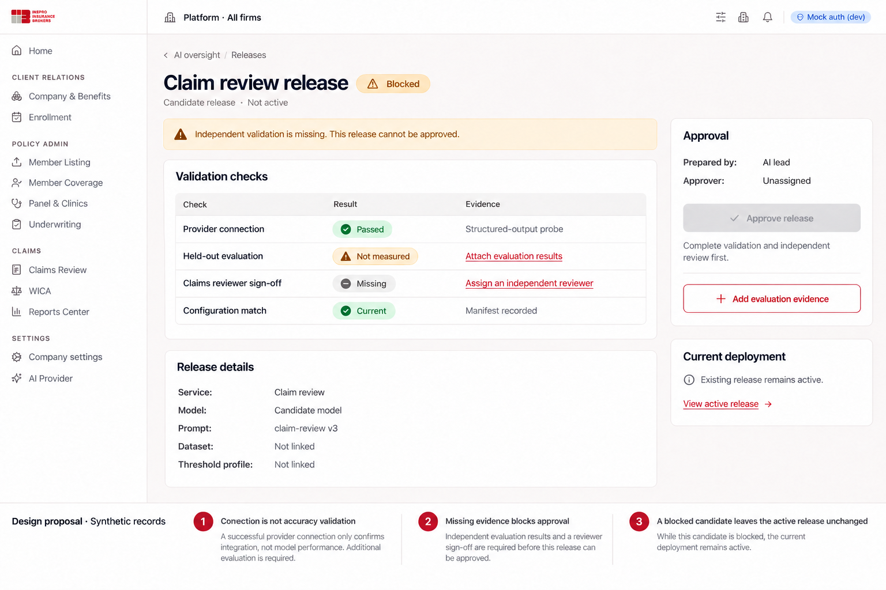
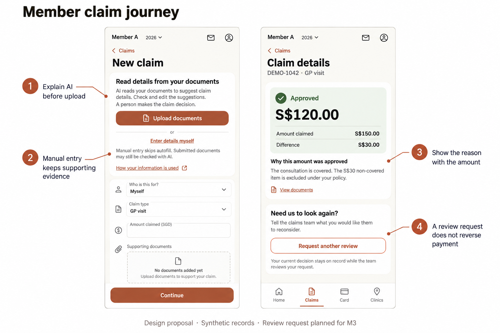

# AI governance UI/UX design

> Historical design handoff. The current interface is [AI Settings](AI_SETTINGS.md): Provider & usage, Policies, and AI use & access. The separate oversight and owner-assignment prototypes described below have been retired.

Status: proposed annotated design handoff, 28 September 2026. The user selected annotated screen designs with an implementation plan. Application implementation and deployment are separate work.

Companions: [implementation plan](AI_GOVERNANCE_IMPLEMENTATION_PLAN.md), [readiness findings](AI_COMPLIANCE_READINESS_2026-09-28.md). Visual sheets are in [the design folder](../output/ai-governance-design-2026-09-28/).

## Design brief

**Job:** help administrators identify the next unresolved AI oversight task; help assessors make and explain a claim decision; help members understand assistance and obtain a human response.

**Mode:** Operate. Information and actions lead. Inherit Inspro's broker and member visual systems; extend existing claim workflows. The register uses familiar dense rows and a contextual detail panel. Avoid a dashboard of scores, charts and decorative status cards.

**Primary proof:** an administrator can find a use with an owner and missing evidence; an assessor can check a document and record a supported decision; a member can see why an amount changed and request reconsideration.

**Visual authority:** broker tokens in `frontend/src/styles.css` and the inspected company-settings screenshot; member components/tokens in `styles/leaf.css` and existing claim components. The recent Home redesign is Home-specific and does not authorize a redesign of claim pages.

**Fidelity:** annotated high-fidelity concept sheets plus exact behavioral specifications. Raster mockups illustrate hierarchy and placement; this document and the implementation plan govern exact copy, access and validation. They are not browser-tested implementations.

## Navigation map



Firm-wide tools currently live in `TopBar.tsx`, with definitions in `FIRM_NAV`; they are not a new company sidebar section. Add a discoverable, accessible AI oversight entry there. On narrow screens, expose the same destination in the navigation menu with its text label. Platform tools require an explicit separate scope and role gate. Do not turn the currently selected company into the apparent owner of a platform release.

## Screen A: firm AI use register

Proposed route: `/firm/ai-oversight`. Delivery: M2. Primary user: broker firm administrator.



**Hierarchy:** persistent firm context; page title; AI uses/Actions/Evidence tabs; search and status filter; register; selected-use panel. No introductory hero, large compliance percentage or duplicate summary cards.

Register columns: AI use/purpose, owner, deployment state, evidence state, next action. The row's title is a proper link; selection is not dependent on clicking an arbitrary blank row. A selected row opens an approximately 390–440px non-modal detail panel at wide widths. Keep the register visible and the current filter/search state in the URL. Deep links work without first visiting the register.

Detail tabs:

- Purpose: intended use, affected people, owner, processing categories, active release, review date and manual alternative.
- Risks: concrete harm, current controls, remaining risk, owner and action; risk scores require a documented scale and never stand alone.
- Evidence: required records, version, reviewer, review due/expiry and gaps.
- History: actor, action, time, version and reason. Sensitive attachment contents remain separately authorized.

Opening the detail panel preserves list position. Escape closes it only when there is no unsaved edit; focus returns to the originating link. A detail opened directly navigates back to the register. Editing uses an explicit form with Save/Cancel, optimistic concurrency and a clear unsaved-change warning. Assigning an owner is a business action, not inferred from who happens to open the page.

At 768–1199px, show the register or the full-width detail; preserve navigation state. At 320–767px, rows become semantic lists with use title, two clearly labelled status lines, owner and next action; secondary history stays in detail. Keep touch controls at least 44px and avoid horizontal page scrolling.

**Annotated intent:** A1 scope stays visible; A2 deployment and evidence states stay separate; A3 the next action opens in context.

**Initial state:** “No AI uses registered for this firm.” Explain that registration does not enable AI. Offer “Register an AI use” and, where available, “Review detected uses.” Detected code/configuration is a draft inventory, never an automatically approved record.

## Screen B: explained claim decision

Existing route: `/claims/review?tab=queue&claim=:id`. Delivery: M1. Primary user: authorized claims assessor.



The mock shows the evidence and decision together. Fit the existing claim workspace/sheet rather than adding a second competing page. At wide widths, retain source evidence to the left and the decision form to the right. Keep claim identity and policy-currency figures visible. Long source documents scroll independently only within their bounded viewer; the decision section remains reachable.

For a synthetic S$150 claim approved at S$120, the form contains:

| Field | Behavior |
| --- | --- |
| Decision | Approve / Reject / Request information. Preserve the selected action while inspecting evidence. |
| Amount approved (SGD) | Required when approving; use existing amount defaults and currency guards. |
| Reason | Required for rejection, reduction or other configured adverse outcome. Plain-language categories. |
| Explanation to member | Required for adverse outcomes; visibly marked as member-facing. |
| Supporting reference | Select a reviewed document/policy reference where applicable; a reference cannot replace the explanation. |
| Internal assessment note | Optional ordinarily. Required as “Reason for overriding the concern” when a material override is detected. Broker-only. |
| Member preview | Shows the exact public explanation and amount; never displays internal rationale or fraud signals. |

The synthetic reduced-payment example agrees with the highlighted excluded expense; an override rationale is therefore not required in that example. The material-override variant inserts its required field adjacent to the concern, instead of requiring extra prose for every routine approval.

Primary actions name the consequence: “Record approval”, “Record rejection” or “Request information”. Do not stack a second “Are you sure?” dialog on every action. Show validation near fields and focus an error summary on unsuccessful submission. Preserve entered text on server errors. Announce successful recording, update the existing queue and retain a link to the decision record.

A stale claim revision displays: “This claim changed while you were reviewing it. Review the changes before deciding.” Preserve the draft explanation locally in memory, show the changed fields and require a refreshed decision context. Never autosubmit after refresh.

On mobile, document/evidence and decision sections stack. Offer an explicit “View document” control that returns to the same form position. A sticky action area respects safe areas and the on-screen keyboard and does not cover the last field. Do not squeeze a two-column desktop viewer onto the phone.

**Annotated intent:** B1 evidence remains close; B2 reductions need a usable member explanation; B3 public and internal text have separate audiences.

## Screen C: platform validation and release review

Proposed route: `/platform/ai-oversight/releases/:id`. Delivery: M2. Primary user: platform administrator/release approver.



The screen starts with the service/release name, candidate state and the blocking reason. Show validation checks in rows: provider connection, independent evaluation, reviewer approval and manifest match. “Passed” on the connection row cannot turn the release into an approved state.

The body links the candidate's model, prompt, dataset, configuration and threshold-profile versions. Technical identifiers belong here because they help a release approver decide; they do not belong in member claim flows. Actual model identifiers must come from the manifest rather than hardcoded sample labels.

Show evaluation metrics only when evidence exists. Each metric needs case count, denominator, dataset/version and group coverage. Missing observations say “Not measured”; do not display zero errors or 100% accuracy. Display the distinction between calibration and held-out evaluation prominently enough that an approver can see which one was run.

Approval panel: preparer, authorized approver, outstanding requirements, approval reason and “Approve release.” Blocked actions have a nearby readable explanation; do not rely on a hover tooltip over a disabled button. Completing an evaluation does not approve or activate the release automatically.

After approval, show an explicit activation step stating the affected deployments and rollback/manual alternative. Changing the candidate invalidates prior approval. A blocked candidate leaves the active release unchanged; suspension of an active release routes affected claims to manual handling according to the approved procedure.

**Annotated intent:** C1 connectivity differs from accuracy; C2 missing validation is a real gate; C3 candidate review does not silently alter production.

On mobile, checks stack as labelled rows and approval follows the evidence. Do not pin a prominent activation button above incomplete evidence.

## Screen D: member intake and reconsideration

Existing intake and detail surfaces: `/portal/claims/*`. Disclosure: M1. Structured review request: M3.



**Before upload:** place this information adjacent to the first extraction action, not after an upload or behind a tooltip:

> AI reads your documents to suggest claim details. Check and edit the suggestions. A person makes the claim decision.

Actions: “Upload documents” and “Enter details myself”. Supporting text: “Manual entry skips autofill. Submitted documents may still be checked with AI.” Link “How your information is used” to the approved privacy explanation. This design does not promise that manual entry prevents all AI processing and does not introduce a blanket consent checkbox.

**After extraction:** highlight fields needing attention with words as well as color. Keep original readings and member corrections available in an expandable comparison. The member can edit all supported fields. Avoid presenting model confidence as a probability of eligibility or approval.

**After decision:** outcome and approved amount lead; claimed amount and difference follow. Show the assessor's public explanation directly below. “Request another review” opens an inline form/full-width sheet with “What would you like us to reconsider?” and optional supporting documents. Explain that submitting the request keeps the current decision on record while the team reviews it.

On submission, show “Review requested” as a separate status with the request date and member message; retain the original claim/payment status. Replace the request action with “View review request” while one is open. Do not invent a response deadline. Later resolutions show who responded by team/role as appropriate, a clear explanation and any separately processed adjustment.

For insurer decisions, describe the next step as referral to the insurer. Paid claims follow the controlled adjustment path; a review request must never cancel payment. Existing claim messaging remains available before M3 ships.

**Annotated intent:** D1 disclose before extraction; D2 clarify the manual path; D3 show reason alongside money; D4 reconsideration preserves history.

## Screen E: risk, evidence and policy detail

Delivery: M2. This companion screen uses the same register/detail composition as A, not a separate dashboard.

```text
Firm-wide · Demo brokerage
AI oversight                 AI uses | Actions | Evidence

Evidence                                      [Add evidence]
Record               Version    Review state       Owner
AI policy            Draft 1    Action required    Firm admin
Assessor training    —          Not recorded       Claims lead
Data processing      v1         Review due         Privacy owner

Selected: AI policy
Scope       This broker firm's use of AI
Owner       Firm admin
Document    AI-policy-draft.pdf        [View document]
Version     Draft 1
Reviewer    Unassigned                 [Assign reviewer]
Next step   Assign a reviewer before requesting approval.

[Save draft]   [Request approval — unavailable until complete]
History     Created by … · …
```

Document approval is an attributed event on a version, never a manually editable “compliant” checkbox. “Request approval” is an internal workflow event; integrations that message people are a later separately authorized implementation choice. An approval must preserve the exact version and reviewer identity. Edits create a new draft; the prior approved version remains current until explicitly superseded, unless revoked or expired.

Attach evidence via an approved document link or retained attachment with classification and access checks. Do not add a rich-text policy authoring suite in the first release. Restrict individual competence records more narrowly than a general summary. Evidence exports identify scope, date and versions and require authorization.

## Screen F: data and supplier evidence

Proposed route: `/platform/ai-oversight?tab=data-suppliers`; firm-specific records live in the firm workspace. Delivery: M2.

```text
Platform · All firms
AI oversight      AI services | Releases | Data & suppliers | Actions

Supplier: Google Vertex AI             Review state: Action required
Applies to       Claim intake, claim review, configured extraction
Processing       Configured Singapore endpoint [View configuration]
Data categories  Claim documents; health information; identifiers

Evidence                                      State
Processing agreement                          Not linked
Retention and training-use terms              Needs verification
Inspro retention schedule                     Awaiting approval
Deletion / backup procedure                   Not linked

Next action  Verify provider terms  · Owner: Privacy owner
[Add evidence]   [Create action]
```

“Configured Singapore endpoint” is a configuration fact, not proof of every supplier processing commitment. Do not state “No training”, “Zero retention” or a legally required retention duration without verified contractual evidence. Unknown values stay unknown with an owner/action. Expose credential management only through the existing AI Provider page and its role gates; never include keys in evidence.

## State and permission specification

| State | User experience |
| --- | --- |
| Loading | Stable headings and lightweight skeleton rows; no zero counts before data is known. |
| Empty | Explain the first action and its consequence; registration does not activate AI. |
| No search matches | Keep search/filter controls and offer Clear filters. |
| Read-only | Show authorized records, omit mutation actions and explain access where useful. Disabled controls are not authorization. |
| Forbidden | Scope-safe message; no names, counts or attachments from an unauthorized firm. |
| Fetch failure | “We couldn't load these records” with retry; preserve user filters. |
| Save failure | Keep entered values, show a clear recovery action and avoid false success. |
| Conflict | Identify that another update occurred; offer refreshed comparison, never overwrite silently. |
| Overdue/expired | Show dates and next action; do not automatically certify, disable or delete unrelated workflows. |
| Running evaluation | Progress from real job state, cancellation semantics and durable status; no fake countdown. |
| Superseded release/evidence | Readable history with a link to the current version; mutation controls removed. |
| Manual handling | Explicit operating state; members can still submit claims. |

Platform admins manage platform records. Firm admins manage their own firm. A governance owner assignment does not automatically confer access to raw medical evidence. Claims access continues to use the existing claims-role and company-scope checks. HR users and members do not receive internal AI findings, protected risk notes or assessor rationale. Member endpoints return only that member's authorized household claims and public review-request data.

## Accessibility and responsive acceptance

- Use semantic tables at desktop and labelled list/detail structures when stacked. Sorting/filtering and selected state are keyboard operable.
- Visible focus, meaningful labels, error associations and live save/status announcements are required. Status always has text; color is supplemental.
- Preserve minimum 4.5:1 text contrast, 3:1 necessary control-boundary contrast and 44px touch targets. Validate against actual composited portal backgrounds.
- At 200% zoom and 320px width, every task remains available without page-level horizontal scrolling. Individual document/table viewers can scroll when needed and must be labelled.
- Respect reduced motion; transitions clarify opening a detail or a saved state and do not hide content initially.
- Use the existing broker and member components/tokens; do not hardcode a second theme or transplant Home's decorative treatment into administration.
- Restore focus and scroll after closing details or returning from a document. Warn before losing an unsaved explanation.
- Accept long company names, translated content, long filenames, multiple documents, no reviewer, expired evidence and missing model metadata without clipping essential actions.

## Design review scenarios

Review these with a firm administrator, claims assessor and member representative before production implementation:

1. Identify the next action for an active AI use whose evidence is incomplete; verify that “Active” is not read as “approved/compliant.”
2. Reduce a claim from S$150 to S$120, preview the member explanation and verify that an internal note is invisible to the member.
3. Attempt to approve a model with a successful connection but no held-out evaluation; understand why it is blocked.
4. Enter a claim manually and correctly understand whether submitted documents may still be AI-reviewed.
5. Request another review and confirm the member does not infer that the original decision or payment has already been reversed.
6. Switch between firm and platform oversight and identify who will be affected before editing anything.

The specifications above describe the intended production behavior. Organizational policies and backend governance services remain pending.

## Local frontend review — 28 September 2026

Interactive React screens now run inside the existing Inspro application. Open **AI oversight** in the top bar, then use the related workflow links, or open these pages directly:

- Firm register, actions and evidence: http://127.0.0.1:5173/firm/ai-oversight
- Platform services and release controls: http://127.0.0.1:5173/platform/ai-oversight
- Assessor decision and member explanation: http://127.0.0.1:5173/claims/review?preview=ai-governance
- Member disclosure, outcome and reconsideration: http://127.0.0.1:5173/firm/ai-oversight/member-journey

Select a demo company if the claims page prompts for company context. The member journey is an administrator review surface containing member-facing content.

These development-only screens use synthetic, in-memory sample data. Navigation preserves sample edits; refresh or **Reset samples** restores the starting state. No claims, approvals, document contents or messages are submitted. Production persistence, governance API authorization, audit records, real evaluations and member-portal integration remain future implementation work.

Recorded assessor decisions retain their private rationale and supporting reference across navigation in a separate in-memory record; member content receives only the public decision. Owner-assignment controls open the selected use's editor. Task-based next actions select the corresponding action, including an assessment task created when registering a new use. Regression coverage in `frontend/e2e/ai-governance.spec.ts` runs on desktop and mobile in the deployment pipeline.

Validation: frontend build passed; `node frontend/scripts/qa-ai-governance.cjs` passed interactions, role visibility and responsive checks at 320, 390 and 1536px, with zero reported main-region axe violations, JavaScript errors or business API mutations. The visual reviewer marked the local frontend ready for review after the release-version inconsistency was resolved. This is not a production deployment or a compliance certification.
